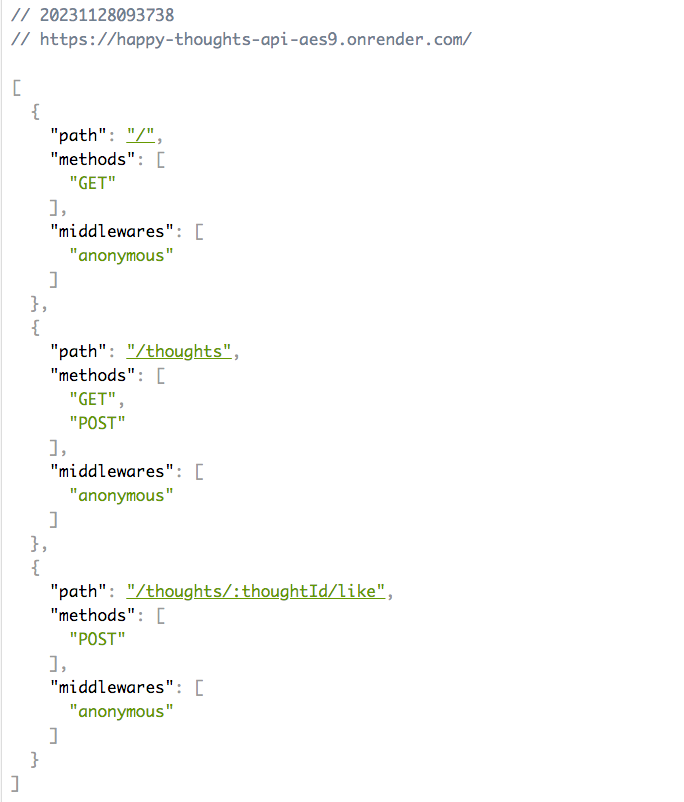
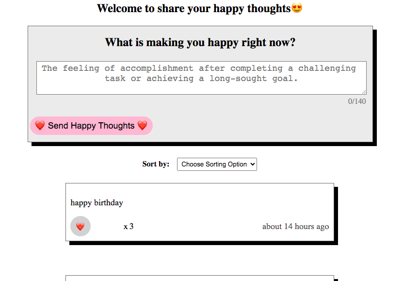

# Project Happy Thoughts API
Welcome to the Happy Thoughts API project! This API serves as the backend for storing and retrieving happy thoughts in a MongoDB database. It complements the front-end project by providing a reliable and scalable solution for managing positive messages.
## The problem
The project presented a couple of challenges that required thoughtful solutions.

### Issue 1: "addHeart" and "updatedThought" Section
One of the most challenging aspects was implementing the "addHeart" and "updatedThought" functionalities. Initially, I attempted to use findOneAndUpdate but encountered difficulties in locating the specific thought. After reassessment, I opted for findById, as it allowed me to first locate the thought by its unique identifier and then proceed with the necessary updates.

### Issue 2: Sorting Functionality
Implementing the sorting functionality posed another challenge. Initially, I observed that the default sorting was based on the lowest number of hearts, which was not the desired behavior. I aimed to have the data sorted by time by default, and then allow users to trigger sorting by hearts when clicking the option.

To address this, I realized the need for an if condition on the front end. This condition ensures that the default sorting is based on the order of time, providing a more intuitive and user-friendly experience.

Approach
Troubleshooting: Identified and addressed the limitations of findOneAndUpdate and transitioned to using findById for more precise updates.

Sorting Enhancement: Implemented an if condition on the front end to achieve the desired default sorting behavior based on time.

## Future Improvements
- Real-time Updates: Explore the integration of real-time updates to instantly reflect changes made by users. In this project, there is still a delay problem when the user click the like button, it will delay one second. The user has to double click the button. I will try to improve this area in the future. 
  
Feel free to explore the API and provide any feedback or suggestions for further improvements. Happy coding!
## View it live(It will load a while, please check the back-end version first)
[Back-End Deployment](https://happy-thoughts-api-aes9.onrender.com) 

[Front-End Deployment](https://mikos-happy-thoughts.netlify.app/)

[Front-End Repo](https://github.com/MikoZhu/Happy_Thoughts)
